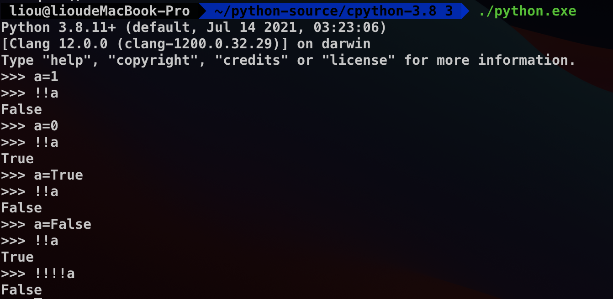
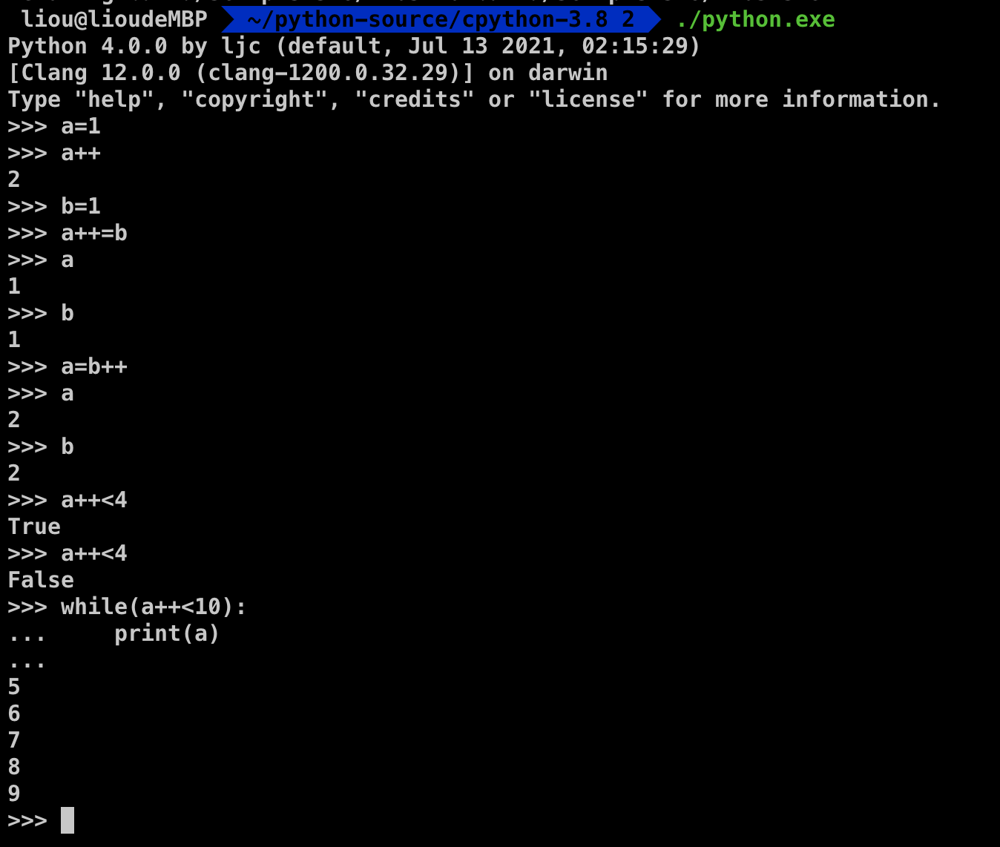

# 八、CPython语法改动实验:增加“非”与“前缀自增”

-- by liou， 未经许可禁止转载

本文是“CPython Compiler Analyse“系列博客的第八章实验部分。该系列文章主要针对CPython3.8的编译器部分进行分析，该系列目录为：

0. Python环境配置、Makefile分析
1. CPython概述
2. CPython词法分析
3. CPython语法分析
4. CPython中CST到AST和AST优化
5. CPython符号表和CFG生成
6. CPython字节码生成和窥孔优化
7. CPython字节码执行
8. CPython语法改动实验:!和++
9. reference

## 0.Abstract

* 在进行本章实验前，你需要先配置或掌握：

  * 下载CPython源码并掌握其编译方法。
  * 了解编译原理基本概念，包括主要步骤的输入、输出和方法等内容。
  * 本章不会详细分析源码内容。所以请结合之前的章节自行阅读源代码。

* 在本章内容中，我们的目标是**在已有的CPython编译器上增加一个新的语法改动**。这个语法改动需要和已有的Python语法尽可能兼容，并且需要修改CPython后端使该语法得到支持。

* 本章我们首先会从整体上分析整个CPython编译器的编译流程，并且找出如果要进行语法改动的话需要修改的相关文件和参数等内容，将这些点整理为了一个修改语法的Check List。

* 我们在这里沿用龙书中对编译器的划分，将其分为分析部分和综合部分，也就是我们常说的前端和后端：

  * 编译器前端（分析部分）：把源程序分解为多个组成要素，并在这些要素上加上语法结构。然后使用这个结构创建一个**中间表示**，与在源程序中收集到的信息形成的**符号表**一起传送给综合部分。
  * 编译器后端（综合部分）：根据分析部分得到的中间表示和符号表来构造用户期待的目标程序。

  CPython编译器同样遵从该分类，在下一节内容中将详细说明CPython编译器前后端的各个流程。

* 根据前后端的分类，本章实验尝试增加两个语法改动：

  * 仅改动前端部分的“非”操作。
  * 前后端同时改动的“前缀++”操作。

#### 本章目录

[toc]

## 1.CPython编译器所有改动点概览

### 1.1.编译器总图概述

* 我们直接开始看整个CPython编译器的结构图：

  

* 为了使文法的变更更加方便，CPython中大量使用了“生成文件式”的方法，如图中绿色高亮的文件就依赖于蓝色高亮的文件。该模式非常类似词法分析中的lex和语法分析中的Yacc。

* 图中红色的高亮部分标记出了从源代码src一直到字节码PyCodeObject结构的各个中间表示根据这些中间表示我们可以将CPython的编译器编译流程分为以下几个步骤：

  1. Tokenizer：根据Token文件构造词法分析器为语法分析器提供GetToken接口。注意CPython中词法分析和语法分析是同时进行的，语法分析器循环调用GetToken接口不断获得新的Token内容，不需要产生一个词法分析结果文件。
  2. ParseToken：根据Grammar文件中的EBNF构造语法分析器，该分析器采用LL1自顶向下分析方式，使用Token接口将源文件src直接翻译为CST语法分析树。
  3. GenAST：根据Python.asdl文件中描述的AST节点构造所需要的C语言的AST结构，并使用**固定的**AST生成器将CST转化为AST。注意这里强调了固定的，是为了区别于完全依赖于Token和Grammar的词法和语法分析器，这是因为CST到AST这一步的翻译方案已经非常复杂且凌乱，很难用一个类似词法或者文法的统一的方式描述全部的内容。虽然这一步同样使用了类似的生成文件的方式，但是此处的生成文件仅能提供原料而不能改变算法，核心的CST到AST的翻译方式还是在这个已经写好并且不会生成的AST生成器中。这就使得词法和文法阶段只需要更改Token和Grammar文件就能够控制一切，而到了AST及之后的步骤就不能再这样做了。
  4. AST Optimal & Symtable：AST优化以及符号表生成。优化步骤在本次实验中不需要考虑。而符号表生成则关乎到Python对namespace的控制，所以如果要进行一些涉及命名空间和存储的语法改动时必须要考虑这个步骤。
  5. Compile：该步实现了从AST节点生成CFG控制流图的过程。其主要目的是根据不同的AST生成对应的opcode，也就是字节码命令。CFG存在的主要原因是解决跳转问题，所以在该步骤进行完之后opcode基本已经生成完毕。
  6. Assemble & Peephole：dfs便利CFG结构，控制空间开销，完成所有的跳转回填并生成最终字节码。之后使用Peephole模块进行窥孔优化。
  7. Eval：即最终字节码的执行模块。字节码中各个命令在之前仅仅代表着一个个不同的宏数字，而在这里才真正的被赋予了不同含义。该模块维护一个栈式执行结构，根据不同的字节码命令调用对应的虚拟机接口实现相关功能。所以创建新的字节码需要修改该部分。

### 1.2.Tokenizer

* 该部分主要包含四个部分：

  * Tokens词法描述文件
  * generate_token.py用于根据Tokens生成token.h/.c的模块
  * token.h/.c词法C语言结构
  * tokenizer.c词法分析器

* 正如总图中所示，编译器在进行语法分析的过程中调用词法分析器请求一个新的Token，该词法分析器根据token.h/.c中所描述的词法规则来回应这一需求。而规定词法分析器行为的token.h/.c则是在编译阶段根据Tokens文件生成的。

* 也就是说，要改变词法分析器的行为仅需要改变Tokens文件，但是在改动之后必须要手动重新编译生成新的token.h/.c文件。

* 具体的编译步骤在Makefile文件中，我们可以在终端中通过如下命令查看：

  ```shell
  make -n regen-token
  ```

  结果如下：

  ```shell
  // shell
  $ make -n regen-token
  # Regenerate Doc/library/token-list.inc from Grammar/Tokens
  # using Tools/scripts/generate_token.py
  python3 ./Tools/scripts/generate_token.py rst \
  		./Grammar/Tokens \
  		./Doc/library/token-list.inc
  # Regenerate Include/token.h from Grammar/Tokens
  # using Tools/scripts/generate_token.py
  python3 ./Tools/scripts/generate_token.py h \
  		./Grammar/Tokens \
  		./Include/token.h
  # Regenerate Parser/token.c from Grammar/Tokens
  # using Tools/scripts/generate_token.py
  python3 ./Tools/scripts/generate_token.py c \
  		./Grammar/Tokens \
  		./Parser/token.c
  # Regenerate Lib/token.py from Grammar/Tokens
  # using Tools/scripts/generate_token.py
  python3 ./Tools/scripts/generate_token.py py \
  		./Grammar/Tokens \
  		./Lib/token.py
  ```

* 可以发现该命令主要生成了四个文件：Doc文档、token.py模块以及token.h/.c。我们只需要关注后两个内容。

* 首先来简单看一下在/Grammar/Tokens中规定了词法单元的信息：

  ```c
  // Grammar/Tokens节选
  ENDMARKER
  NAME
  NUMBER
  STRING
  NEWLINE
  INDENT
  DEDENT
  
  LPAR                    '('
  RPAR                    ')'
  LSQB                    '['
  RSQB                    ']'
  COLON                   ':'
  COMMA                   ','
  SEMI                    ';'
  PLUS                    '+'
  MINUS                   '-'
  ...
  ```

* 然后来看一下根据该文件生成的token.h，该文件包含Tokens中的宏、一个结构体和三个函数：

  ```c
  // parse/token.h节选
  #define ENDMARKER       0
  #define NAME            1
  #define NUMBER          2
  #define STRING          3
  #define NEWLINE         4
  #define INDENT          5
  #define DEDENT          6
  #define LPAR            7
  #define RPAR            8
  #define LSQB            9
  ...
    
  PyAPI_DATA(const char * const) _PyParser_TokenNames[]; /* Token names */
  PyAPI_FUNC(int) PyToken_OneChar(int);
  PyAPI_FUNC(int) PyToken_TwoChars(int, int);
  PyAPI_FUNC(int) PyToken_ThreeChars(int, int, int);
  ```

* 我们可以发现Tokens文件完全控制着词法分析器的全部行为，所以我们仅需要根据需求改变Tokens文件就能达到想要的词法分析结果。

* 具体的Tokenizer代码此处不做详细叙述。

### 1.3.ParseToken

* 非常类似于Token部分，该部分同样包含四个部分：

  * Grammar语法描述文件
  * pgen根据Grammar生成graminit.h/.c的模块
  * graminit.h/.c语法C语言结构
  * parsetok.c语法分析器

* 该部分逻辑还和词法一模一样，我们同样首先来看编译指令：

  ```shell
  // shell
  $ make -n regen-grammar
  # Regenerate Doc/library/token-list.inc from Grammar/Tokens
  # using Tools/scripts/generate_token.py
  python3 ./Tools/scripts/generate_token.py rst \
  		./Grammar/Tokens \
  		./Doc/library/token-list.inc
  # Regenerate Include/token.h from Grammar/Tokens
  # using Tools/scripts/generate_token.py
  python3 ./Tools/scripts/generate_token.py h \
  		./Grammar/Tokens \
  		./Include/token.h
  # Regenerate Parser/token.c from Grammar/Tokens
  # using Tools/scripts/generate_token.py
  python3 ./Tools/scripts/generate_token.py c \
  		./Grammar/Tokens \
  		./Parser/token.c
  # Regenerate Lib/token.py from Grammar/Tokens
  # using Tools/scripts/generate_token.py
  python3 ./Tools/scripts/generate_token.py py \
  		./Grammar/Tokens \
  		./Lib/token.py
  # Regenerate Include/graminit.h and Python/graminit.c
  # from Grammar/Grammar using pgen
  ./install-sh -c -d Include
  PYTHONPATH=. python3 -m Parser.pgen ./Grammar/Grammar \
  		./Grammar/Tokens \
  		./Include/graminit.h.new \
  		./Python/graminit.c.new
  python3 ./Tools/scripts/update_file.py ./Include/graminit.h ./Include/graminit.h.new
  python3 ./Tools/scripts/update_file.py ./Python/graminit.c ./Python/graminit.c.new
  ```

* 可以发现regen-grammar指令会先调用regen-token指令，所以生成的前四个部分均是token相关内容。而之后使用pgen模块根据Grammar文件生成所需的graminit.h/.c文件。

* 值得注意的是，pgen是Python语言中最为古老的模块之一，曾是Python之父Guido van Rossum写下的第一个c代码。pgen是一个较为严格按照龙书中描述的使用EBNF的LL1自顶向下语法分析器。在Python的发展后期该部分被使用Python语言重新编写，也就是当前命令中使用的Parser.pgen模块。然而在现在看来该分析器存在着不少的缺点，Rossum就发[文](https://medium.com/@gvanrossum_83706/peg-parsers-7ed72462f97c)描述该分析器的弊端。并且**在Python3.9开始引入一个全新的PEG分析器**，在Python3.9中PEG和pgen并存，默认使用PEG，而**在Python3.10中将计划完全替换掉pgen模块**。这也是为什么本系列选择了Python3.8版本的原因。

* 我们首先来简单看一下Grammar中的EBNF文法：

  ```c
  // Grammar/Grammar节选
  single_input: NEWLINE | simple_stmt | compound_stmt NEWLINE
  file_input: (NEWLINE | stmt)* ENDMARKER
  eval_input: testlist NEWLINE* ENDMARKER
  
  decorator: '@' dotted_name [ '(' [arglist] ')' ] NEWLINE
  decorators: decorator+
  decorated: decorators (classdef | funcdef | async_funcdef)
  
  async_funcdef: ASYNC funcdef
  funcdef: 'def' NAME parameters ['->' test] ':' [TYPE_COMMENT] func_body_suite
  
  parameters: '(' [typedargslist] ')'
  
  ...
  
  stmt: simple_stmt | compound_stmt
  simple_stmt: small_stmt (';' small_stmt)* [';'] NEWLINE
  small_stmt: (expr_stmt | del_stmt | pass_stmt | flow_stmt |
               import_stmt | global_stmt | nonlocal_stmt | assert_stmt)
  expr_stmt: testlist_star_expr (annassign | augassign (yield_expr|testlist) |
                       [('=' (yield_expr|testlist_star_expr))+ [TYPE_COMMENT]] )
  annassign: ':' test ['=' (yield_expr|testlist_star_expr)]
  testlist_star_expr: (test|star_expr) (',' (test|star_expr))* [',']
  augassign: ('+=' | '-=' | '*=' | '@=' | '/=' | '%=' | '&=' | '|=' | '^=' |
              '<<=' | '>>=' | '**=' | '//=')
  ...
  ```

  EBNF略不同于BNF表示，如*表示0个或者多个，+表示1个或者多个，[]表示可有可无。有了这样的特性，EBNF在处理左递归等情况下会更加灵活而简洁。

* pgen模块根据Grammar文件生成graminit.h/.c文件，其实就是生成了一堆dfa。其中.h文件中保存着dfa需要的各种结构体定义，而.c文件中则就是全部的自动机定义。由于生成过程中使用顺序编号命名所以该文件基本不可读。在本章中也不会详细描述pgen以及parsetok的具体细节。我们仅需要知道，通过设置Grammar文件就能够完全控制语法分析器的行为。

### 1.4.GenAST

* 该部分同样包含四个部分：
  * Python.asdl AST结构描述文件
  * asdl_c.py/asdl.py 根据上面描述文件生成下面结构的模块
  * Python-ast.h/.c AST节点定义及节点构造函数
  * ast.c AST生成器

* 正如前文所提到的，从这一步开始CPython虽然仍在使用一些生成文件，但是此时的生成文件仅能完成一部分的内容，再也没办法实现像之前步骤中控制一个文件就控制全部分析器的情况。

* 我们首先应该明白的一点是：**CST和AST是完完全全的两种树**，绝对不能像一些博客中描述的那样把AST看作打了补丁信息的CST。 CST是一种完全根据Grammar规定生成的东西，是一个只需要外形满足而不考虑内在灵魂的“死”的东西，而AST则是一个具备了灵魂的“活”的东西，其中所谓的灵魂就是语义。

  * 没有语义的CST只能严格根据Grammar文法中的规定生成树结构，这就使其多出了很多近似语义的冗余内容，比如二元操作在AST中都为BinOp类型，而在CST中则需要花大量篇幅区分各类逻辑算符和计算符号。
  * 同时也缺少了在高层次对复杂模块的统一而简洁的表示，比如for循环在CST中需要堆叠大量节点来区分各种省略和不省略结构，而在AST中则就是一个简洁的for结构。
  * 还有就是CST所有节点结构一致，仅通过一个n_type字段记录节点类型，节点内结构过于简单（见node.h/.c）。而AST根据不同节点类型有着不同的节点结构，能够将该节点的参数全部保存在节点之内。从表达能力上要远强于CST。

* 我们接下来要明白的一点是，**在CST到AST翻译的过程中，二者并没有真正相遇过**。在具体的翻译过程中所采用的翻译方式是：先构造一个空的顶层AST根节点，然后自顶向下递归遍历已有的CST树，根据不同的情况和语义在已有的AST树上调用相关AST节点构造函数。**全程其实并不存在所谓的CST转化为AST的步骤，而应该是遍历已有的CST并建立一颗新的AST**。

* 接下来我们还是首先来看需要手动编译的生成文件：

  ```shell
  // shell
  $ make -n regen-ast
  # Regenerate Include/Python-ast.h using Parser/asdl_c.py -h
  ./install-sh -c -d ./Include
  python3 ./Parser/asdl_c.py \
  		-h ./Include/Python-ast.h.new \
  		./Parser/Python.asdl
  python3 ./Tools/scripts/update_file.py ./Include/Python-ast.h ./Include/Python-ast.h.new
  # Regenerate Python/Python-ast.c using Parser/asdl_c.py -c
  ./install-sh -c -d ./Python
  python3 ./Parser/asdl_c.py \
  		-c ./Python/Python-ast.c.new \
  		./Parser/Python.asdl
  python3 ./Tools/scripts/update_file.py ./Python/Python-ast.c ./Python/Python-ast.c.new
  ```

* 可以看到这里主要是使用asdl_c.py模块根据Python.asdl生成Python-ast.h/.c。其中的asdl_c部分不是本章的讨论重点。我们首先来看Python.asdl文件：

  ```
  // Parse/Python.asdl节选
  module Python
  {
      mod = Module(stmt* body, type_ignore *type_ignores)
          | Interactive(stmt* body)
          | Expression(expr body)
          | FunctionType(expr* argtypes, expr returns)
  
          -- not really an actual node but useful in Jython's typesystem.
          | Suite(stmt* body)
  
      stmt = FunctionDef(identifier name, arguments args,
                         stmt* body, expr* decorator_list, expr? returns,
                         string? type_comment)
            | AsyncFunctionDef(identifier name, arguments args,
                               stmt* body, expr* decorator_list, expr? returns,
                               string? type_comment)
  		...
  }
  ```

  正如前文所述，asdl文件中描述的是AST的结构信息，其实就是各个子节点的**构造函数**，比如如果当前CST节点是一个函数定义式的stmt，则只需要将该函数定义中的name、args等内容在CST中递归地找到，然后在当前AST树中调用FunctionDef函数就能构造一个这样的AST节点。

* 所以总结起来，Python.asdl中能够包含的信息为：构造每个AST节点需要的参数子节点的类型和数量（参数中的*号代表该参数可能有多个）。所以根据Python.asdl中提供的信息所生成的Python-ast.h/.c文件中主要也仅包含两种内容：

  * 节点类型的结构体定义
  * 节点的构造函数

  我们随便举一个赋值表达式Assign的例子：

  ```c
  // Assign的Python.asdl和Python-ast.h/.c节选
  
  // Python.asdl
  // 一个赋值语句包含一个或多个左值，一个右值，以及一个可选的类型描述
  stmt = 	...
    			| Assign(expr* targets, expr value, string? type_comment)	
    			...
  
  // Python-ast.h节选
  ...
  typedef struct _stmt *stmt_ty;		// 构造函数中使用的_ty类型其实是复杂结构体的指针
  ...
  enum _stmt_kind {FunctionDef_kind=1, AsyncFunctionDef_kind=2, ClassDef_kind=3,
                    Return_kind=4, Delete_kind=5, Assign_kind=6,
                    AugAssign_kind=7, AnnAssign_kind=8, For_kind=9,
                    AsyncFor_kind=10, While_kind=11, If_kind=12, With_kind=13,
                    AsyncWith_kind=14, Raise_kind=15, Try_kind=16,
                    Assert_kind=17, Import_kind=18, ImportFrom_kind=19,
                    Global_kind=20, Nonlocal_kind=21, Expr_kind=22, Pass_kind=23,
                    Break_kind=24, Continue_kind=25};
  // 一个stmt可能包含很多类别，所以用一个enum来记录该stmt到底是什么类型，下面的union类型则代表着不同类型的stmt有着不同的成员，比如此处的Assign作为赋值语句拥有一个或多个左值targets和一个右值value， 以及一个说明类型的string
  struct _stmt {		
      enum _stmt_kind kind;		// 如果该stmt节点是一个Assign，那么这个字段就应该为Assign_kind=6
      union {
          struct {
            ,,,
          } FunctionDef;
  				...
          struct {
              asdl_seq *targets;
              expr_ty value;
              string type_comment;
          } Assign;
  
          struct {
            ...
          } AugAssign;
  				...
      } v;
      int lineno;			// 记录该AST节点在源代码中的行号、列偏移等内容
      int col_offset;
      int end_lineno;
      int end_col_offset;
  };
  
  // Python-ast.c中Assign构造函数的节选
  stmt_ty							// 返回值应该是一个stmt类型的指针，指向一个Assign类型的stmt节点
  Assign(asdl_seq * targets, expr_ty value, string type_comment, int lineno, int
         col_offset, int end_lineno, int end_col_offset, PyArena *arena)
  {		// 传入参数完全参照Python.asdl，但是每个节点的构造函数最后四个参数都是代表着源码行列偏移之类的内容
      stmt_ty p;
      if (!value) {		// 参数检查
          PyErr_SetString(PyExc_ValueError,
                          "field value is required for Assign");
          return NULL;
      }
      p = (stmt_ty)PyArena_Malloc(arena, sizeof(*p));		// 内存分配，arena是CPython中的一个内存管理单元
      if (!p)			
          return NULL;
      p->kind = Assign_kind;					// 根据传入参数填写该AST信息
      p->v.Assign.targets = targets;
      p->v.Assign.value = value;
      p->v.Assign.type_comment = type_comment;
      p->lineno = lineno;
      p->col_offset = col_offset;
      p->end_lineno = end_lineno;
      p->end_col_offset = end_col_offset;
      return p;												
  }
  ```

  

* 所以看完了AST部分的函数，会发现这部分本身是一堆很简单甚至有点无聊的东西。不过还是要注意如上文提到的第二点，Python.asdl和Python-ast.h/.c文件中没有和CST的任何一点关系，这些部分仅仅是提供了一个AST的构造接口。

* 所以接下来来看AST生成部分最为核心的生成部分，该部分主要做的事情是：

  * 一边递归遍历CST
  * 一边调用API生成AST

  这些内容全部都在ast.c文件之中，该文件提供一个PyAST_FromNode的API用于将CST转化为AST。此外该文件还提供另一个名为PyAST_Validate的API用于验证AST。这两个部分互相独立没有关联。

* 所以ast.c中主要包含以下两种内容：

  * ast_for_xxx类型的函数，其中xxx代表某个CST节点类型。对应CST->AST内容。
  * validate_xxx类型的函数，其中的xxx代表某个AST节点类型。对应Validate内容。

* 我们只关注第一类函数，下面依旧以Assign举例：

  ```c
  // 赋值语句的AST生成过程节选
  
  ********************************************分界线****************************************************
  // 官方文档中该段落的节选
    
  // 官方文档中的文法只是一种用于规定的简洁表示，其中存在诸多左递归或公因子等问题，所以比Grammar文件中的内容更简单。
  // 官方文档中包含三种赋值语句：普通赋值、增强赋值和带标注的赋值。这里只截取了普通赋值。
  assignment_stmt ::=  (target_list "=")+ (starred_expression | yield_expression)
  target_list     ::=  target ("," target)* [","]
  target          ::=  identifier
                       | "(" [target_list] ")"
                       | "[" [target_list] "]"
                       | attributeref
                       | subscription
                       | slicing
                       | "*" target
    
    
  ********************************************分界线****************************************************
  // Grammar/Grammar节选
    
  // 可以看出为了实际实现这里必须将上文所述的三种赋值类型放在一起考虑，可读性很差
  expr_stmt: 	testlist_star_expr (		// expr stmt需要一个testlist star expr加一坨东西（）
    						annassign 						// 这一坨东西首先可以是一个带标注的annassign
    						| augassign (yield_expr|testlist) 	// 还可以是一个增强赋值表达式
             		|	[			// 当然还可以既不是标注赋值也不是增强赋值，甚至是个[]可选什么都没有也行。如果什么都没有则就是个expr式的stmt，根赋值一点关系都没有
                  	('=' (yield_expr|testlist_star_expr))+ 	// 当然如果有等号就得是赋值，甚至“=右值”的组合可以有多个，因为有个+号
                  	[TYPE_COMMENT]	// 当然还可以是一个标注赋值，这里有一个可选的TYPE_COMMENT
                	] 
  						)
  annassign: ':' test ['=' (yield_expr|testlist_star_expr)]			 // 带标注的赋值
  testlist_star_expr: (test|star_expr) (',' (test|star_expr))* [',']		// 一个或多个左值
  augassign: ('+=' | '-=' | '*=' | '@=' | '/=' | '%=' | '&=' | '|=' | '^=' |	// 增强赋值符号
              '<<=' | '>>=' | '**=' | '//=')
  // 所以看了这个Grammar你也能感受到为了实现一个有丰富特性的语法需要写一个多么繁琐的EBNF，定义这个文法的人是个什么神仙。
  
  
  ********************************************分界线****************************************************
  // Python/ast.c中ast_for_expr_stmt中对普通赋值的部分节选
    
  // 如果你大概看懂了上面的Grammar文法的一半就能很快明白这个函数在干啥
  static stmt_ty
  ast_for_expr_stmt(struct compiling *c, const node *n)
  {
      REQ(n, expr_stmt);		// #define REQ(n, type) assert(TYPE(n) == (type)) 在node.h中类型判断的宏
    
      int num = NCH(n);		// #define NCH(n) ((n)->n_nchildren)	在node.h中用来获取当前CST节点子节点数的宏
  		// 接下来只有四个if-else分支，就是一种类似LL1或LR1里面那个1的向前看一个一步的操作，只不过当前可以看的不仅仅是文法中前后顺序中的后一个字符，而是一颗树中当前节点的全部子节点
    	
    	// 首先判断如果子节点数为1，就代表该expr_stmt中只有一个testlist_star_expr，第二个()中走了[]部分的空
      if (num == 1) {
          expr_ty e = ast_for_testlist(c, CHILD(n, 0));		// 递归处理testlist_star_expr
          ...
          return Expr(e, LINENO(n), n->n_col_offset,		// 处理完的testlist_star_expr应该会返回一个Expr类型的AST节点，将其链接进当前的AST中
                      n->n_end_lineno, n->n_end_col_offset, c->c_arena);
      }
      else if (TYPE(CHILD(n, 1)) == augassign) {	// 接下来使用CHILD查看第二个子节点，如果是augassign就代表这是个增强赋值语句
          expr_ty expr1, expr2;
          operator_ty newoperator;
          node *ch = CHILD(n, 0);
  
          expr1 = ast_for_testlist(c, ch);		// 找到左值
  				...
          ch = CHILD(n, 2);		
          if (TYPE(ch) == testlist)						// 判断类型并找到右值
              expr2 = ast_for_testlist(c, ch);
          else
              expr2 = ast_for_expr(c, ch);
          ...
          newoperator = ast_for_augassign(c, CHILD(n, 1));		// 找到增强语句的操作符号
          ...
          return AugAssign(expr1, newoperator, expr2, LINENO(n), n->n_col_offset,	// 构造AST节点
                           n->n_end_lineno, n->n_end_col_offset, c->c_arena);
      }
      else if (TYPE(CHILD(n, 1)) == annassign) {		// 如果是annassign则该stmt是一个带标注的赋值语句
          expr_ty expr1, expr2, expr3;
          node *ch = CHILD(n, 0);
          node *deep, *ann = CHILD(n, 1);
          int simple = 1;
  				...
          expr1 = ast_for_testlist(c, ch);		// 取第一个expr
          ...
          ch = CHILD(ann, 1);
          expr2 = ast_for_expr(c, ch);				// 取第二个expr
          ...
          if (NCH(ann) == 2) {								// 判断当前子节点数决定是否有第三个expr，没有就传一个NULL
              return AnnAssign(expr1, expr2, NULL, simple,	// NULL
                               LINENO(n), n->n_col_offset,
                               n->n_end_lineno, n->n_end_col_offset, c->c_arena);
          }
          else {
              ch = CHILD(ann, 3);
              if (TYPE(ch) == testlist_star_expr) {		// 根据类型取第三个expr
                  expr3 = ast_for_testlist(c, ch);
              }
              else {
                  expr3 = ast_for_expr(c, ch);
              }
              ...
              return AnnAssign(expr1, expr2, expr3, simple,		// 调用构造函数
                               LINENO(n), n->n_col_offset,
                               n->n_end_lineno, n->n_end_col_offset, c->c_arena);
          }
      }
      else {
          int i, nch_minus_type, has_type_comment;
          asdl_seq *targets;
          node *value;
          expr_ty expression;
          string type_comment;
  
          /* a normal assignment */
          REQ(CHILD(n, 1), EQUAL);		// 一个普通赋值，检查第二个节点是不是=号
  
          has_type_comment = TYPE(CHILD(n, num - 1)) == TYPE_COMMENT;		// 判断是否有类型标记
          nch_minus_type = num - has_type_comment;				// 一个不考虑类型标记语句的比较巧的写法
  
          targets = _Py_asdl_seq_new(nch_minus_type / 2, c->c_arena);		// 左值可以有多个，需要new不定长类型
          ...
          for (i = 0; i < nch_minus_type - 2; i += 2) {
              expr_ty e;
              node *ch = CHILD(n, i);
              ...
              e = ast_for_testlist(c, ch);
              ...
              asdl_seq_SET(targets, i / 2, e);		// 遍历每一个左值，取其expr放进tergets序列中
          }
          value = CHILD(n, nch_minus_type - 1);		
          if (TYPE(value) == testlist_star_expr)			// 判断类型并取右值
              expression = ast_for_testlist(c, value);
          else
              expression = ast_for_expr(c, value);
          ...
          if (has_type_comment) {				// 如果有类型标记字段，则取该子段
              type_comment = NEW_TYPE_COMMENT(CHILD(n, nch_minus_type));
              ...
          }
          ...
          return Assign(targets, expression, type_comment, LINENO(n), n->n_col_offset,	// 构造AST节点
                        n->n_end_lineno, n->n_end_col_offset, c->c_arena);
      }
  }
  
  ```

* 如果你大概看懂了上述的这个例子，那么你应该就掌握了这一部分的代码流程。即使看不懂也没关系，因为本章的语法改动不会涉及这么复杂的改动。
* 总的来说，改动这一部分代码主要涉及两个方面：
  * 根据需要设计新的AST节点结构
  * 根据需要设计CST到AST的翻译方案

### 1.5.Compile & Assemble

*  由于本次实验不会涉及Symtable的改动，同时语法改动不考虑代码优化，所以这本章略过这几部分内容。仅描述Compile部分的改动方法。

* 在AST和符号表之后我们已经来到了CPython编译器的后端部分。后端整体的感觉还是和前端有所不同的：

  * 由于中间AST或者CFG表示已经具备了很强的表示能力，并且在结构上已经嵌入了大量的语义信息，同时通过符号表还维护了一个强有力的命名空间逻辑。所以后端部分其实比前端要简单，或者至少有很多API可以调能显得更为简洁。
  * 也正是由于后端AST已经表达了很多的信息，所以后端仅为了处理字节码跳转等较为复杂的情况引入了一个新的CFG中间表示。总的来说后端再也不需要像前端那样变来变去，每个步骤间有十分明确的界限，后端每个步骤更加简单步骤间没有那么明确的界限感。所以可以发现后端代码中的Compile和Assemble两步都被放在了一个compile.c文件中，这也是为什么很多博客包括官方的一些文档中都将AST->字节码中间的所有操作合并称作一个步骤。
  * 综合上面两点，后端代码的特点就是**各种简洁的代码堆成一坨**。所以在写文档的过程中非常不好写，因为有很多琐碎的点好像需要提及，但是每个点本身都不太难而且相互不挨着。所以这部分推荐大家去阅读源代码，

* 所以总的来说，编译阶段只干了两件事：

  * 遍历AST节点，根据不同节点生成opcode信息，如果遇到跳转则暂时不管。
  * 把各个代码块连接起来，补全之间的跳转关系。

  除此之外，在compile.c中还在前面放置了对AST优化和符号表生成函数的调用，在后面放置了Peephole的函数调用。虽然前两个看起来并不能算是后端内容、后一个貌似也更应该和编译剥离开来，但是CPython还是把它们放在了一起，大概是因为这些部分内容太少没必要分开吧。。。

* 在开始compile之前，我们还是先看一下此处的生成文件：

  ```shell
  // shell
  $ make -n regen-opcode
  # Regenerate Include/opcode.h from Lib/opcode.py
  # using Tools/scripts/generate_opcode_h.py
  python3 ./Tools/scripts/generate_opcode_h.py \
  		./Lib/opcode.py \
  		./Include/opcode.h.new
  python3 ./Tools/scripts/update_file.py ./Include/opcode.h ./Include/opcode.h.new
  ```

  这是使用generate_opcode_h.py模块根据Lib/opcode.py生成opcode.h的编译命令。

* opcode.h即为全部opcode也就是字节码指令的宏定义，所以如果我们需要增加一个新的字节码就需要更改opcode.py文件并重新编译。

* 接下来我们只关注我们需要关注的部分，也就是根据AST生成opcode的部分，主要包含两类函数：

  * compiler_visit_xxx，xxx是某个AST节点，代表遍历到了某个复杂AST节点，即可能有多态的节点。而由于AST结构本身已经很简单，而且没有为顶层的mod构造同样的函数。所以这个类型的函数只有stmt、expr、slice和keyword。
  * compiler_xxx，xxx是某个AST节点，代表构造这个节点类型的字节码。

* 接下来我们依旧以Assign赋值语句为例：

  ```c
  // Python/compile.c中Assign节选
  static int
  compiler_visit_stmt(struct compiler *c, stmt_ty s)
  {
      Py_ssize_t i, n;
  
      /* Always assign a lineno to the next instruction for a stmt. */
      c->u->u_lineno = s->lineno;
      c->u->u_col_offset = s->col_offset;
      c->u->u_lineno_set = 0;
  
      switch (s->kind) {	// 遍历并检查当前AST节点类型
      case Assign_kind:		// 如果是Assign普通赋值语句，该语句较为简单可以直接生成
          n = asdl_seq_LEN(s->v.Assign.targets);	// 取当前左值数量
          VISIT(c, expr, s->v.Assign.value);		// 生成右值opcode，会生成一个LOAD NAME，将右值放置在栈顶
          for (i = 0; i < n; i++) {			// 遍历全部左值
              if (i < n - 1)
                  ADDOP(c, DUP_TOP);		// 前n-1次都先生成一个DUP TOP命令，该命令会将栈顶也就是右值复制一次，因为每次赋值需要使用STORE NAME命令会将栈顶右值弹出一个，而第n次也就是最后一次执行不需要赋值，把第一次取到的右值用作STORE
              VISIT(c, expr,		// 递归调用expr，会生成一个STORE NAME命令
                    (expr_ty)asdl_seq_GET(s->v.Assign.targets, i));
          }
          break;
      case AugAssign_kind:		// 较为复杂所以单独编写了一个函数
          return compiler_augassign(c, s);
      ...
      return 1;
  }
  ```

* 简单来说，编译过程中需要做的就是根据不同的节点来生成相应的opcode，而如果遇到需要处理的跳转还需要生成一些代码块用于之后在CFG阶段回填跳转位置，这里以for循环为例：

  ```c
  // Python.asdl中for循环的节选
  stmt 	=	...
  				| For(expr target, expr iter, stmt* body, stmt* orelse, string? type_comment)
    			// 	类似于：
    			// 	for target in iter：type_comment
    			// 			body
    			//	else：
    			//			orelse
  				...
    
  // Python/compile.c中for节点的节选
  static int
  compiler_for(struct compiler *c, stmt_ty s)
  {
      basicblock *start, *cleanup, *end;
  
      start = compiler_new_block(c);			// 创建三个代码块
      cleanup = compiler_new_block(c);
      end = compiler_new_block(c);
     	...
      VISIT(c, expr, s->v.For.iter);			// 先创建iter相关代码，将iter创建出来
      ADDOP(c, GET_ITER);									// 增加一个开始迭代命令
      compiler_use_next_block(c, start);	// 在开始的位置增加一个start块，相当于一个跳转标记
      ADDOP_JREL(c, FOR_ITER, cleanup);		// JREL是Jump to a RELative position的缩写，即到cleanup块的相对跳转，因为这里的cleanup位置还不确定
      VISIT(c, expr, s->v.For.target);		// 创建target的命令
      VISIT_SEQ(c, stmt, s->v.For.body);	// 创建循环体序列命令
      ADDOP_JABS(c, JUMP_ABSOLUTE, start);	// JABS是Jump to an ABSolute position的缩写，即到开始块的绝对跳转
      compiler_use_next_block(c, cleanup);	// 在这里增加一个cleanup块
  
      compiler_pop_fblock(c, FOR_LOOP, start);	// 循环执行完毕，弹出栈中的for帧
  
      VISIT_SEQ(c, stmt, s->v.For.orelse);	// 创建orlese代码
      compiler_use_next_block(c, end);	// 设置end块
      return 1;
  }
  ```

* 对于之后的Assemble步骤目的则更为简单：

  * dfs遍历CFG记录块间顺序
  * 然后将CFG展开铺平
  * 回填所有的跳转目标
  * 打包PyCodeObject

* 这里简单看一下代码：

  ```c
  // Python/compile.c中assemble函数节选
  
  static PyCodeObject *
  assemble(struct compiler *c, int addNone)
  {
      basicblock *b, *entryblock;
      struct assembler a;
      int i, j, nblocks;
      PyCodeObject *co = NULL;
  
      /* Make sure every block that falls off the end returns None.
         XXX NEXT_BLOCK() isn't quite right, because if the last
         block ends with a jump or return b_next shouldn't set.
       */
      if (!c->u->u_curblock->b_return) {
          NEXT_BLOCK(c);
          if (addNone)
              ADDOP_LOAD_CONST(c, Py_None);
          ADDOP(c, RETURN_VALUE);
      }
  
      nblocks = 0;
      entryblock = NULL;
      for (b = c->u->u_blocks; b != NULL; b = b->b_list) {	// 遍历记录块数并找到入口点
          nblocks++;
          entryblock = b;
      }
  
      ...
      dfs(c, entryblock, &a, nblocks);		// 开始dfs
  
      /* Can't modify the bytecode after computing jump offsets. */
      assemble_jump_offsets(&a, c);				// 铺平CFG，回填跳转位置
  
      /* Emit code in reverse postorder from dfs. */
      for (i = a.a_nblocks - 1; i >= 0; i--) {
          b = a.a_postorder[i];
          for (j = 0; j < b->b_iused; j++)
              if (!assemble_emit(&a, &b->b_instr[j]))		// 生成跳转语句
                  goto error;
      }
  		...
      co = makecode(c, &a);	// 打包PyCodeObject，里面会先调用Peephole进行优化
   error:
      assemble_free(&a);
      return co;
  }
  ```

* 至此就走完了CPython编译器的全部流程，然后对于语法改动实验而言这还是不够的。我们还需要了解并修改字节码的执行部件才能最终实现对新特性的完全支持。

### 1.6.Eval

* CPython虚拟机是一个栈式解释器，虚拟机中维护了一个运行栈。本系列博客主要针对CPython编译器进行分析，所以在本章中我们不需要了解太多虚拟机细节，只需要知道虚拟机解释器的大概解释流程是：

  1. 构造一个执行线程
  2. 构造一个栈帧
  3. 将键参数打包为一个字典、加载键参数、补全缺失的键参数
  4. 将位置参数转化为变量，把位置参数打包为*args，补全缺失的位置参数
  5. 创建生成器、协程和异步生成器
  6. 调用PyEval_EvalFrameEx（）开始执行字节码。通常来讲，最终会进入到_PyEval_EvalFrameDefault()函数之中，所以我们只需要了解这个函数的内部即可。

* 这个函数非常之长，代码量有三千多行。而我们只需要大改了解它会做什么即可：

  ```c
  // Python/ceval.c中_PyEval_EvalFrameDefault节选
  
  PyObject* _Py_HOT_FUNCTION
  _PyEval_EvalFrameDefault(PyFrameObject *f, int throwflag)
  {
    	...	
      PyObject **stack_pointer;  /* Next free slot in value stack */
      const _Py_CODEUNIT *next_instr;
      int opcode;        /* Current opcode */
      int oparg;         /* Current opcode argument, if any */
      PyObject **fastlocals, **freevars;
      PyObject *retval = NULL;            /* Return value */
      _PyRuntimeState * const runtime = &_PyRuntime;
      PyThreadState * const tstate = _PyRuntimeState_GetThreadState(runtime);
      struct _ceval_runtime_state * const ceval = &runtime->ceval;
      _Py_atomic_int * const eval_breaker = &ceval->eval_breaker;
      PyCodeObject *co;
    	...
  /* Stack manipulation macros */
  
  /* The stack can grow at most MAXINT deep, as co_nlocals and
     co_stacksize are ints. */
  #define STACK_LEVEL()     ((int)(stack_pointer - f->f_valuestack))
  #define EMPTY()           (STACK_LEVEL() == 0)
  #define TOP()             (stack_pointer[-1])
  #define SECOND()          (stack_pointer[-2])
  #define THIRD()           (stack_pointer[-3])
  #define FOURTH()          (stack_pointer[-4])
  #define PEEK(n)           (stack_pointer[-(n)])
  #define SET_TOP(v)        (stack_pointer[-1] = (v))
  #define SET_SECOND(v)     (stack_pointer[-2] = (v))
  #define SET_THIRD(v)      (stack_pointer[-3] = (v))
  #define SET_FOURTH(v)     (stack_pointer[-4] = (v))
  #define SET_VALUE(n, v)   (stack_pointer[-(n)] = (v))
  #define BASIC_STACKADJ(n) (stack_pointer += n)
  #define BASIC_PUSH(v)     (*stack_pointer++ = (v))
  #define BASIC_POP()       (*--stack_pointer)
    	...
        
  main_loop:
      for (;;) {
        	switch (opcode) {	// 这是一个两千多行的switch，在这里列举了全部的opcode执行方式
  						...
              case TARGET(UNARY_NEGATIVE): {	// 这里以负号作为例子
                  PyObject *value = TOP();		// 取栈顶元素
                  PyObject *res = PyNumber_Negative(value);		// 调用API使其值取负
                  Py_DECREF(value);		// 减少对value的引用
                  SET_TOP(res);				// 将新值放在栈顶
                  if (res == NULL)
                      goto error;
                  DISPATCH();
              }
              ...
          }
      }
  }
  ```

* 我们并不需要了解得太深刻，只需要知道执行过程是在一个巨大无比的switch中罗列不同的opcode，每个opcode内调用不同的API实现功能即可。

### 1.7.Check List

* 综上这里给出如果想要做出一个语法改动可能需要考虑的改动流程：
  1. 修改Grammar/Tokens文件，增加新的Token种类，regen文件，手动编译并测试
  2. 修改Grammar/Grammar文件，增加新的文法，regen文件，手动编译并测试
  3. 修改Parse/Python.asdl文件，增加新的AST结构，regen文件，手动编译并测试
  4. 修改Python/ast.c文件，增加新CST节点或新AST节点的翻译方案，手动编译并测试
  5. 修改Python/symtable.c文件，增加新语法的符号表行为，手动编译并测试
  6. 修改opcode.py文件，增加新的字节码类型，regen文件，手动编译并测试
  7. 修改Python/compile.c，增加新的AST或者新的字节码翻译方案，手动编译并测试
  8. 修改Python/ceval.c，增加新的字节码执行方案，手动编译并测试

## 2.CPython编译器前端改动实验：“非”

* 实现一个前缀“非”操作，即逻辑取反。为了避免语法冲突这里使用双!的形式
* 由于CPython官方实现了一元非操作的AST结构和UNARY_NOT字节码及相关逻辑，但是不支持前端的！语法。所以实现这个语法特性只需要修改前端使其能够识别该形式，然后在生成AST的过程中将前端一元非翻译为对应的AST节点即可。

### 2.1.改动总图


### 2.2.Token & Grammar

* 词法改动直接新增：

  ```c
  // Tokens
  NOT		'!!'		// 直接增加一个新的Token类别
  ```

* 文法改动的话，非属于前缀一元运算，所以直接在该位置增加一个新的部分：

  ```c
  // Grammar
  factor: ('+'|'-'|'~'|'!!') factor | postfix
  ```

* 词法&语法部分只需要这些改动即可，接下来进行手动编译：

  ```shell
  make regen-grammar & make -j4
  ```

* 接下来进行测试，在源码根目录下创建一个test.py文件，写入：

  ```python
  # test.py
  import symbol
  import token
  import parser
  from pprint import pprint
  import dis
  import ast
  
  def lex(expression):
      symbols = {v: k for k, v in symbol.__dict__.items() if isinstance(v, int)}
      tokens = {v: k for k, v in token.__dict__.items() if isinstance(v, int)}
      lexicon = {**symbols, **tokens}
      st = parser.expr(expression)
      st_list = parser.st2list(st)
  
      def replace(l: list):
          r = []
          for i in l:
              if isinstance(i, list):
                  r.append(replace(i))
              else:
                  if i in lexicon:
                      r.append(lexicon[i])
                  else:
                      r.append(i)
          return r
  
      return replace(st_list)
  
  test_s = '!!a'
  pprint(lex(test_s))
  #print(ast.dump(ast.parse(test_s)))
  #tmp = dis.dis(test_s)
  ```

* 然后运行该测试文件，得到新文法的CST：

  ```shell
  // shell
  $ ./python.exe test.py
  ['eval_input',
   ['testlist',
    ['test',
     ['or_test',
      ['and_test',
       ['not_test',
        ['comparison',
         ['expr',
          ['xor_expr',
           ['and_expr',
            ['shift_expr',
             ['arith_expr',
              ['term',
               ['factor',
                ['NOT', '!!'],
                ['factor',
                 ['power', ['atom_expr', ['atom', ['NAME', 'a']]]]]]]]]]]]]]]]]],
   ['NEWLINE', ''],
   ['ENDMARKER', '']]
  ```

### 2.3.AST

* 我们查看Python.asdl可以发现，CPython已经实现了一元非的AST逻辑，以及相应的字节码部分，不过并不是用来支持前端一元非语法的。也就是说在后端支持该特性但在前端并不支持。

  ```c
  // Parse/Python.asdl
  unaryop = Invert | Not | UAdd | USub 
  ```

* 所以我们只需要将刚刚完成的前端翻译到对应的后端AST即可，在ast.c中新增翻译方式：

  ```c
  
  static expr_ty
  ast_for_factor(struct compiling *c, const node *n)
  {
      expr_ty expression;
  
      expression = ast_for_expr(c, CHILD(n, 1));
      if (!expression)
          return NULL;
  
      switch (TYPE(CHILD(n, 0))) {
          case PLUS:
              return UnaryOp(UAdd, expression, LINENO(n), n->n_col_offset,
                             n->n_end_lineno, n->n_end_col_offset,
                             c->c_arena);
          case MINUS:
              return UnaryOp(USub, expression, LINENO(n), n->n_col_offset,
                             n->n_end_lineno, n->n_end_col_offset,
                             c->c_arena);
          case TILDE:
              return UnaryOp(Invert, expression, LINENO(n), n->n_col_offset,
                             n->n_end_lineno, n->n_end_col_offset,
                             c->c_arena);
          case NOT:
              return UnaryOp(Not, expression, LINENO(n), n->n_col_offset,
                             n->n_end_lineno, n->n_end_col_offset,
                             c->c_arena);
      }
      PyErr_Format(PyExc_SystemError, "unhandled factor: %d",
                   TYPE(CHILD(n, 0)));
      return NULL;
  }
  ```

* 重新编译：

  ```shell
  // shell
  make -j4
  ```

* 将test.py文件倒数第二行取消注释，运行测试文件：

  ```shell
  // shell
  $ ./python.exe test.py
  ['eval_input',
   ['testlist',
    ['test',
     ['or_test',
      ['and_test',
       ['not_test',
        ['comparison',
         ['expr',
          ['xor_expr',
           ['and_expr',
            ['shift_expr',
             ['arith_expr',
              ['term',
               ['factor',
                ['NOT', '!!'],
                ['factor',
                 ['power', ['atom_expr', ['atom', ['NAME', 'a']]]]]]]]]]]]]]]]]],
   ['NEWLINE', ''],
   ['ENDMARKER', '']]
  Module(body=[Expr(value=UnaryOp(op=Not(), operand=Name(id='a', ctx=Load())))], type_ignores=[])
  ```

  得到正确的AST结构。

* 最终在终端中确认该语法结果正确：

  
  

## 3.CPython编译器后端改动实验：“前缀++”

* 实现一个一元++操作，该操作能够使一个变量立即自增1。

* 首先需要区分清楚的是“前缀++”后“后缀++”的区别，这里首先贴一下C11中对这两者的描述：

  >C11
  >
  >Prefix++：
  >
  >**The value of the operand of the prefix ++ operator is incremented. The result is the new value of the operand after incrementation.** The expression ++E is equivalent to (E+=1). See the discussions of additive operators and compound assignment for information on constraints, types, side effects, and conversions and the effects of operations on pointers.
  >
  >Postfix++:
  >
  >**The result of the postfix ++ operator is the value of the operand**. **As a side effect, the value of the operand object is incremented** (that is, the value 1 of the appropriate type is added to it). See the discussions of additive operators and compound assignment for information on constraints, types, and conversions and the effects of operations on pointers. **The value computation of the result is sequenced before the side effect of updating the stored value of the operand**. With respect to an indeterminately-sequenced function call, the operation of postfix ++ is a single evaluation. Postfix ++ on an object with atomic type is a read-modify-write operation with memory_order_seq_cst memory order semantics.

* 可以看到：

  * 前缀++会令operand的值立刻加一，++的效果和+=1是一致的。整个一元表达式的结果就是这个加一之后的operand值。
  * 后缀++则不会对operand的值做任何改变，一元表达式的结果就是当前operand的值。后缀++是通过创建一个会令operand值加一的副作用来实现自增，并且这个副作用会在该结果被使用之后生效。

* 所以如果要实现后缀++，我们需要实现一个延迟执行的副作用，其最核心的问题就是该副作用被延迟到什么时候执行。Python语法设计者极力避免在Python中出现后缀++的操作，所以我们没有办法在现行语法中借鉴到延迟执行的位置。如果类比我们对C语言中后缀++的理解，这个延迟转移的位置可能会在一整个expr或者expr stmt结束之后。假设是这种情况，我们可能需要：

  * 先在expr和expr stmt等AST节点位置新增一个记录当前语句中是否存在后缀++的标记
  * 然后在递归处理的过程中如果扫描到后缀++就需要先修改外层的标记，然后记录该后缀++的operand，也就是被延迟加一的变量
  * 由于一个式子中可能会出现多个后缀++，所以记录operand的应该是一个序列结构。
  * 最后在递归处理语句结束后，如果发现后缀标记为真，则证明该式子中存在后缀++，则需要按顺序将operand序列中的每个变量加一保存。

* 依照上面的思路理论上我们是可以实现后缀++操作的，但是我们光借鉴C语言的经验是不够的，还需要额外考虑Python本身的语法特性，我们需要考虑好新增的后缀++与迭代器、yield语句、带标记语句、try-expect语句、元组列表字典等各种语法特性间的兼容关系，甚至其中有些内容和后缀++的兼容情况没有在Python或者其他语言中出现过，我们无从借鉴必须自行定义。所以**在改动CPython编译器的过程中，真正的难点不是该懂本身而是设计一个足够完美的语法。**所以在本章中我们仅实现能够参考+=1操作的前缀++。

* 上述的所有++都可以替换为--，此处不在赘述。

* 另外一点就是，由于Python本身有一个前缀+号表示正号，并且这个+可以有多个所以会出现**写在变量前面的++的情况**，所以为了保持兼容，我们令一个**后端设计为“前缀++”特性的立即增加的一元操作**，在前端被识别为**写在变量后面的++的形式**，也就是实现了一个**长得像后缀++，但表现得像前缀++”**的特性。这段话写得太绕了大家理解一下。。。

### 3.1.改动总图


### 3.2.Token & Grammar

* 首先在Tokens文件中增加新的Token：

  ```c
  // Grammar/Tokens新增
  JIAJIA		'++'
  ```

* 然后在Grammar文件中增加对++的文法支持。我们再次参考C11标准：

  > C11中对prefix的operand的描述
  >
  > The operand of the prefix increment or decrement operator shall have atomic, qualified, or unqualified real or pointer type, and shall be a modifiable lvalue.
  >
  > 前缀递增或递减运算符的操作数应具有原子的、限定的或非限定的实数或指针类型，并且应为可修改的左值。

* 可以看到在C语言中后缀++操作符被限定为实数或者指针并且可修改，然而在语法更加灵活的Python中却要复杂得多：

  ```c
  // Python官方文档对强赋值操作的节选
  augmented_assignment_stmt ::=  augtarget augop (expression_list | yield_expression)
  augtarget                 ::=  identifier | attributeref | subscription | slicing
  augop                     ::=  "+=" | "-=" | "*=" | "@=" | "/=" | "//=" | "%=" | "**="
                                 | ">>=" | "<<=" | "&=" | "^=" | "|="
  ```

* 可以发现在Python中能够使用+=的左值有四类，更多信息参考[这里](https://docs.python.org/zh-cn/3.8/reference/expressions.html#grammar-token-attributeref)

  * 标识符，也就是变量
  * 属性引用，就是xxx.xxx的形式
  * 抽取，就是在序列（字符串、元组、列表）或者映射（字典）对象中选择一项
  * 切片，就是在序列对象中选择一个范围的值

* 我们再回想一下，前文在讨论语法和AST的部分中我就提到过：官方语法文档是一种简洁直观的表示，为了兼容各种文法细节实际的EBNF要复杂得多，当时我专门用expr_stmt->augassign举例，如果忘记的可以回看1.4.AST最后那个巨长的例子，而实际上在这个例子里面我还仅仅只列出了EBNF的一层内容，如果你感兴趣Python是如何精准地让增强赋值操作的操作数确定为上述四类东西，那么你应该去看Grammar中对testlist_star_expr的推导部分，pgen用了几乎一半篇幅的EBNF才完成这个工作。

* 而看完了前端的语法分析，我们再去看后端的compile.c中如何实现四种类型的强赋值：

  ```c
  // Python/compile.c中强赋值部分的节选
  
  static int
  compiler_augassign(struct compiler *c, stmt_ty s)
  {
      expr_ty e = s->v.AugAssign.target;
      expr_ty auge;
  
      assert(s->kind == AugAssign_kind);
  
      switch (e->kind) {
      case Attribute_kind:		// 如果是属性类型
          auge = Attribute(e->v.Attribute.value, e->v.Attribute.attr,	// 先为当前节点建立一个属性AST
                           AugLoad, e->lineno, e->col_offset,
                           e->end_lineno, e->end_col_offset, c->c_arena);
          ...
          VISIT(c, expr, auge);		// 访问刚刚建立的属性AST节点，生成访问该属性的字节码
          VISIT(c, expr, s->v.AugAssign.value);		// 生成访问value的字节码，也就是比如"+=2"里面的2
          ADDOP(c, inplace_binop(c, s->v.AugAssign.op));	// 生成一个INPLACE的字节码
          auge->v.Attribute.ctx = AugStore;		// 改变该变量也就是刚创建的那个属性的存取方式，这里设置为store存
          VISIT(c, expr, auge);		// 生成一个存储的STORE字节码，代表着把该属性强赋值之后的值保存
          break;
      case Subscript_kind:	// 如果是抽取类型，步骤和属性类型一致
         	...
      case Name_kind:		// 如果是变量
          if (!compiler_nameop(c, e->v.Name.id, Load))	// 该函数根据第二三个参数生成字节码，这里或生成一个LOAD NAME加载该变量
              return 0;
          VISIT(c, expr, s->v.AugAssign.value);		// 生成获取右值的字节码
          ADDOP(c, inplace_binop(c, s->v.AugAssign.op));		// 生成inplace字节码
          return compiler_nameop(c, e->v.Name.id, Store);		// 生成一个STORE NAME
      default:
          ...
      }
      return 1;
  }
  
  ```

  我们会发现一个问题：少了一种类型。

* 实际到了compile时缺失了切片类型，造成该问题的原因在于：在CST->AST翻译的时候将所有的切片值都展开了，如果感兴趣可以去看ast.c里面的ast_for_atom，可以看到里面把中括号处理成一个内置列表，把大括号处理成了内置字典。这部分东西就涉及得太多了本章就不再讨论了。

* 之所以说了很多这些很复杂的东西，目的有两个：

  * 让你体会到一个非常灵活好用的语法糖或者一个看似简单的前端语法表现，在CPython编译和实现起来是多么的复杂。这也印证了我上文提到的编译器设计的真正的难点在于如何设计一个完美的语法。
  * 以防万一真的有人想不开想要实现一个像强赋值语句一眼的支持四种甚至更多类型的前缀++，那么你可能要去处理以下几个问题：
    * 参考augassign的方式，在Grammar中增加四种类型对前缀++的支持。这可能要修正小一半篇幅的EBNF，并且验证整体EBNF无冲突。
    * 上文1.4节中举例子时提到了在Python/ast.c中的ast_for_expr_stmt()中使用了一个取巧的识别方式，即通过独一无二的子节点数直接识别节点类型的方法，在改动完Grammar之后要检查所有的改动点中是否存在这样的情况。
    * 仿照强赋值语句在CST->AST过程中处理切片。
    * 在compile.c中根据不同类型处理字节码生成操作。
    * 根据需求构造新的字节码。

* 所以**截止到到这里，3.2节中出现的除了讨论Token改动的内容如果你看不懂或者不想看，可以直接不看**。

* 在本章实验中，**我们只简单的把我们新增的前缀++的操作数限定为变量**，据此更改Grammar：

  ```c
  // Grammar/Grammar中在NAME之后新增
  atom: ('(' [yield_expr|testlist_comp] ')' |
         '[' [testlist_comp] ']' |
         '{' [dictorsetmaker] '}' |
         NAME ['++'] | NUMBER | STRING+ | '...' | 'None' | 'True' | 'False')
  ```

* 重新编译后，我们将上个实验中test.py文件中的test_s字符串改为'a++'，然后运行测试文件：

  ```shell
  // shell
  $ ./python.exe test.py
  ['eval_input',
   ['testlist',
    ['test',
     ['or_test',
      ['and_test',
       ['not_test',
        ['comparison',
         ['expr',
          ['xor_expr',
           ['and_expr',
            ['shift_expr',
             ['arith_expr',
              ['term',
               ['factor',
                ['power',
                 ['atom_expr',
                  ['atom', ['NAME', 'a'], ['JIAJIA', '++']]]]]]]]]]]]]]]]],
   ['NEWLINE', ''],
   ['ENDMARKER', '']]
  ```

  看到我们生成了正确的语法分析结果。

### 3.3.AST

* 首先需要增加对应的AST结构支持，有两种方式：建立新的前缀AST节点，或是在原有节点上附加信息。因为我们的改动较小所以选择后者，直接在Name节点上新增一个标识是否有前缀操作的字段：

  ```c
  // Python/Python.asdl中改动节选
  expr	=		...
    				| Name(identifier id, expr_context ctx, postfixop postf)	// 新增一个标识字段
    				...
    
  postfixop = JiaJia | NoNoNo		// 标识字段现在有两种含义：有前缀++和空，后续还可以增加前缀--操作
  ```

* 重新编译后，接下来需要在ast.c中处理每一个调用Name API的地方：

  ```c
  // Python/ast.c中改动节选
  
  // 在翻译变量的位置增加判断
  static expr_ty
  ast_for_atom(struct compiling *c, const node *n)
  {
      ...
      switch (TYPE(ch)) {
      case NAME: {
          PyObject *name;
          const char *s = STR(ch);
          size_t len = strlen(s);
          postfixop_ty postf = NoNoNo;
          if (len >= 4 && len <= 5) {
              if (!strcmp(s, "None"))
                  return Constant(Py_None, NULL, LINENO(n), n->n_col_offset,
                                  n->n_end_lineno, n->n_end_col_offset, c->c_arena);
              if (!strcmp(s, "True"))
                  return Constant(Py_True, NULL, LINENO(n), n->n_col_offset,
                                  n->n_end_lineno, n->n_end_col_offset, c->c_arena);
              if (!strcmp(s, "False"))
                  return Constant(Py_False, NULL, LINENO(n), n->n_col_offset,
                                  n->n_end_lineno, n->n_end_col_offset, c->c_arena);
          }
          name = new_identifier(s, c);
          if (NCH(n) == 2) {		// 如果存在前缀节点
              switch (TYPE(CHILD(n, 1)))	// 判断前缀节点类型，使用switch可以很方便地增加其他类型的前缀操作如--
              {
              case JIAJIA:	
                  postf = JiaJia;
                  break;
              default:
                  break;
              }
          }
          if (!name)
              return NULL;
          /* All names start in Load context, but may later be changed. */
          return Name(name, Load, postf, LINENO(n), n->n_col_offset,		// 在这个位置构造Name
                      n->n_end_lineno, n->n_end_col_offset, c->c_arena);
      }
  
          
  // 将该文件中所有其他的出现Name构造函数的位置都处理成这样
  postfixop_ty postf = NoNoNo
  xxx = Name(id, Load, postf, lineno, col_offset, ch->n_end_lineno, ch->n_end_col_offset, c->c_arena);
  ```

* 重新编译后运行测试文件test.py：

  ```shell
  // shell
  $ ./python.exe test.py
  ['eval_input',
   ['testlist',
    ['test',
     ['or_test',
      ['and_test',
       ['not_test',
        ['comparison',
         ['expr',
          ['xor_expr',
           ['and_expr',
            ['shift_expr',
             ['arith_expr',
              ['term',
               ['factor',
                ['power',
                 ['atom_expr',
                  ['atom', ['NAME', 'a'], ['JIAJIA', '++']]]]]]]]]]]]]]]]],
   ['NEWLINE', ''],
   ['ENDMARKER', '']]
  Module(body=[Expr(value=Name(id='a', ctx=Load(), postf=JiaJia()))], type_ignores=[])
  ```

  可以看到生成了正确的AST。

### 3.4.compile

* 首先我们需要增加新的opcode，在opcode.py中增加一个新的类型：

  ```python
  # Lib/opcode.py中新增：
  def_op('UNARY_JIAJIA', 13)	# 序号和位置并不重要，既然一元表达式中间给我空出一行我就选择填在这里
  ```

* 然后手动编译：

  ```shell
  // shell
  make regen-opcode
  ```

* 然后需要在compile.c中增加字节码生成特性：

  ```c
  // Python/compile.c
  
  // 先在stack_effect()中设置字节码的栈属性：
  /* Return the stack effect of opcode with argument oparg.
  
     Some opcodes have different stack effect when jump to the target and
     when not jump. The 'jump' parameter specifies the case:
  
     * 0 -- when not jump
     * 1 -- when jump
     * -1 -- maximal
   */
  /* XXX Make the stack effect of WITH_CLEANUP_START and
     WITH_CLEANUP_FINISH deterministic. */
  static int
  stack_effect(int opcode, int oparg, int jump)
  {
      switch (opcode) {
          ...
          case INPLACE_ADD:
          case INPLACE_SUBTRACT:
          case INPLACE_MULTIPLY:
          case INPLACE_MATRIX_MULTIPLY:
          case INPLACE_MODULO:
          case UNARY_JIAJIA:	// 因为新字节码模仿了INPLACE_ADD，所以我们让栈行为也保持一致
              return -1;
          ...
      }
      ...
  }
  
  // 然后来到翻译Name节点的位置，如果发现有前缀++，就生成相关字节码
  static int
  compiler_visit_expr1(struct compiler *c, expr_ty e)
  {
    	switch (e->kind) {
          ...
          case Name_kind:
              if (e->v.Name.postf==NoNoNo)
                  return compiler_nameop(c, e->v.Name.id, e->v.Name.ctx);
              else {		// 有前缀++
                  if (!compiler_nameop(c, e->v.Name.id, Load))	// 先在栈顶Load该变量
                      return 0;
                  ADDOP(c, UNARY_JIAJIA);		// 生成一个新字节码命令
                  if (!compiler_nameop(c, e->v.Name.id, Store))	// 然后生成一个store命令
                      return 0;
                  return compiler_nameop(c, e->v.Name.id, e->v.Name.ctx);	// 最后需要保持变量存取特性一致
              }
          ...
      }
  }
  ```

* 在完成上述修改之后，编译并运行test.py：

  ```shell
  // shell
  $ ./python.exe test.py
  ['eval_input',
   ['testlist',
    ['test',
     ['or_test',
      ['and_test',
       ['not_test',
        ['comparison',
         ['expr',
          ['xor_expr',
           ['and_expr',
            ['shift_expr',
             ['arith_expr',
              ['term',
               ['factor',
                ['power',
                 ['atom_expr',
                  ['atom', ['NAME', 'a'], ['JIAJIA', '++']]]]]]]]]]]]]]]]],
   ['NEWLINE', ''],
   ['ENDMARKER', '']]
  Module(body=[Expr(value=Name(id='a', ctx=Load(), postf=JiaJia()))], type_ignores=[])
    1           0 LOAD_NAME                0 (a)
                2 UNARY_JIAJIA
                4 STORE_NAME               0 (a)
                6 LOAD_NAME                0 (a)
                8 RETURN_VALUE
  ```

  可以发现我们生成了正确的字节码。

### 3.5.ceval

* 最后我们修改ceval.c函数给予新的字节码UNARY_JIAJIA后端支持：

  ```c
  // Python/ceval.c中节选
  
  PyObject* _Py_HOT_FUNCTION
  _PyEval_EvalFrameDefault(PyFrameObject *f, int throwflag)
  {
    	...	
  main_loop:
      for (;;) {
        	switch (opcode) {	
  						...
              case TARGET(INPLACE_ADD): {		// 我们首先来参考INPLACE_ADD命令的执行方式
                  PyObject *right = POP();	// POP右值
                  PyObject *left = TOP();		// 取左值，因为后续要将结果放在栈顶，所以不需要pop
                  PyObject *sum;
                  if (PyUnicode_CheckExact(left) && PyUnicode_CheckExact(right)) {	// 字符串也可以+=
                      sum = unicode_concatenate(tstate, left, right, f, next_instr);
                      /* unicode_concatenate consumed the ref to left */
                  }
                  else {		// 数值类型调用API做+=运算
                      sum = PyNumber_InPlaceAdd(left, right);
                      Py_DECREF(left);
                  }
                  Py_DECREF(right);	// 减少对右值对象的引用
                  SET_TOP(sum);			// 将结果放在栈顶
                  if (sum == NULL)
                      goto error;
                  DISPATCH();
            	}
              ...
              case TARGET(UNARY_JIAJIA): {	// 据此我们来编写新字节码的执行方式
                  PyObject *right = PyLong_FromLong(1);	// 唯一的不同，就是将右值替换为一个使用API生成的数值1
                  PyObject *left = TOP();
                  PyObject *sum;
                  if (PyUnicode_CheckExact(left) && PyUnicode_CheckExact(right)) {
                      sum = unicode_concatenate(tstate, left, right, f, next_instr);
                      /* unicode_concatenate consumed the ref to left */
                  }
                  else {
                      sum = PyNumber_InPlaceAdd(left, right);
                      Py_DECREF(left);
                  }
                  Py_DECREF(right);
                  SET_TOP(sum);
                  if (sum == NULL)
                      goto error;
                  DISPATCH();
              }
          }
      }
  }
  ```

* 然后我们重新编译，之后就可以在终端里面各种尝试了：

  ```shell
  // shell
  $ make regen-all & make -j4
  $ ./python.exe
  ```

  

## 推荐阅读：

* https://medium.com/@gvanrossum_83706/peg-parsers-7ed72462f97c
* https://realpython.com/cpython-source-code-guide/#part-4-objects-in-cpython
* https://blog.csdn.net/atfield/category_256448.html
* https://www.python.org/dev/peps/pep-0339/
* https://www.python.org/dev/peps/pep-0306/


本文是该系列博客的第一篇文章，本系列其他章节会陆续编写并发布，所有平台文章状态以我的[Github仓库](https://github.com/rm-rf-me/CPython-Compiler-Analyse)为主。如果发现文章中的任何问题欢迎提出issue联系我。
